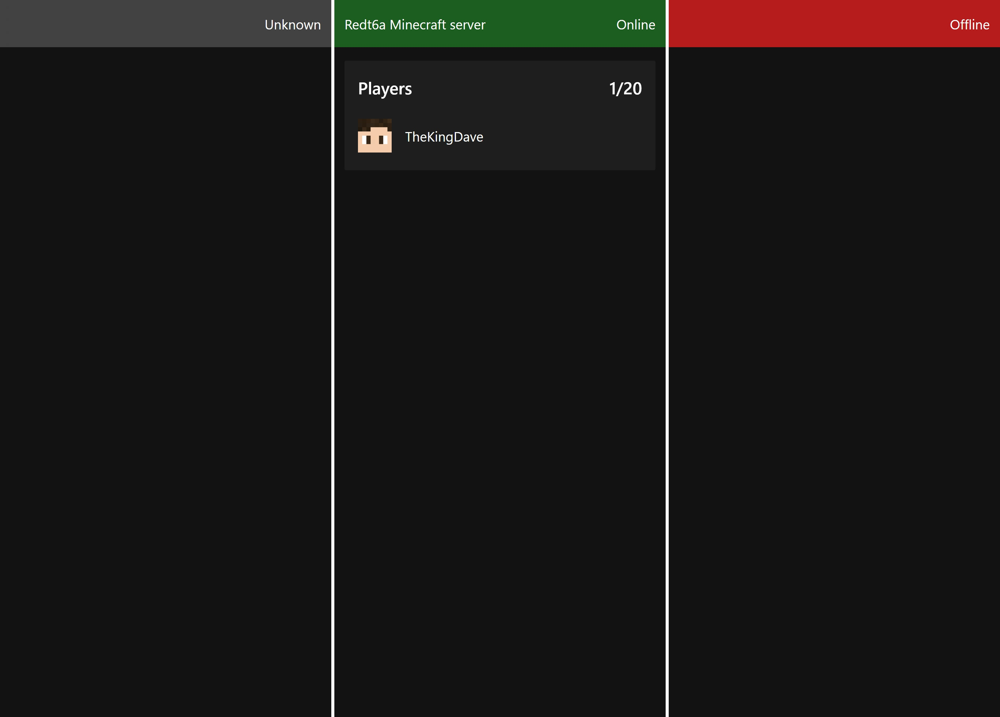

# MC Status
A simple web GUI to show if a server is Online and who is playing right now



The three different states (Service Down, Online, Offline)

## Running
Docker

```docker run thekingdave/mc_status:latest --server example.com```

Docker Compose:
```yaml
version: '3.9'

services:
  mc_status:
    image: thekingdave/mc_status:latest
    ports:
      - '8000:8000'
```

## Config

The priority of the configuration is: CLI Arguments, dotenv, environment, default 

| CLI     | Abbr | ENV      | Description                    | Default    |
| ------- | ---- | -------- | ------------------------------ | ---------- |
| port    | p    | PORT     | Port to listen on              | 8000       |
| host    | h    | HOST     | On which hostname to listen to | 127.0.0.1  |
| server  | s    | SERVER   | Minecraft ip/domain and port   | 127.0.0.1  |
| webPath | w    | WEB_PATH | Where the web GUI is located   | web/public |

You can also create a `.env` file to load environment variables from that file.

## Information

This service uses a combination of HTTP and WebSocket.

| Endpoint | Usage                                                        |
| -------- | ------------------------------------------------------------ |
| /status  | Get the current status of the Minecraft Server               |
| /ws      | WebSocket that pushes changes of the state from the Minecraft Server |
| *        | All other requests serve the static files of the web interface or return a 404 |

If you want to proxy this service, be sure to treat the `/ws` endpoint as a WebSocket.
